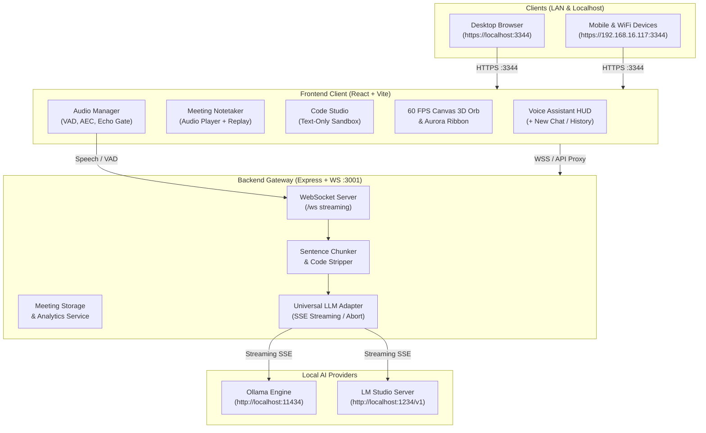

# ⚛️ RVoice Proton

<p align="center">
  
  
  
  
  
  
</p>

<p align="center">
  <strong>Next-Generation Development-Grade Voice AI Workstation, Meeting Intelligence Engine & Dedicated Code Studio</strong><br />
  <em>100% Local, Private, Low-Latency Spoken Dialogue powered by Ollama and LM Studio. Zero Cloud Dependencies. Zero Telemetry.</em>
</p>

---

## 🌟 Executive Overview

**RVoice Proton** is an open-source, production-grade local AI workstation engineered for developers, power users, and teams who want the convenience of modern voice AI and meeting summarization with **100% privacy and local hardware execution**.

Built on a unified high-throughput architecture, RVoice Proton features **zero-latency spoken dialogue**, predictive sentence streaming, an **intelligent meeting notetaker with full audio replay and AI executive summaries**, an isolated **Code Studio** with syntax highlighting, and out-of-the-box **LAN/WiFi hosting with pre-configured SSL certificates** so anyone connected to your local WiFi can access the assistant from their mobile device or laptop without security warnings.

---

## ⚡ Key Pillars & Capabilities

### 🎙️ 1. Conversational Voice Assistant (Zero-Code Spoken Dialogue)
- **Bidirectional Streaming**: Low-latency WebSocket duplex pipeline connecting your microphone directly to your local LLM.
- **Predict-Ahead Sentence Chunking**: Streams token deltas into complete, syntactically coherent sentences for near-instant Text-to-Speech (TTS) response.
- **Barge-In Interruptibility**: Speak at any point during AI playback to immediately abort the TTS audio stream and cancel pending LLM generation.
- **Strict Zero-Code Isolation**: The voice persona strictly converses in natural human speech. It is programmatically prevented from reading long code snippets, syntax characters, or formatting blocks over voice.
- **Multi-Session Management**: Click `+ New Chat` at any time to start fresh conversations, or reopen past discussions via the drawer history.

### 📝 2. Meeting Notetaker & Intelligence Engine
- **Dual-Source Audio Capture**: Records microphone audio alongside system/tab audio (Google Meet, Zoom, Microsoft Teams, browser tabs) using `getDisplayMedia`.
- **Integrated Waveform Audio Player**: Replay meeting recordings with Play/Pause, click-to-seek progress scrubber, dynamic time counters, 1.0x / 1.5x / 2.0x playback speed controls, and one-click `.webm` audio download.
- **Local AI Summarization**: One-click generation of structured meeting intelligence:
  - 📋 **Executive Brief**
  - 🎯 **Key Decisions & Strategic Takeaways**
  - ⚡ **Action Items & Owners**
  - 💬 **Full Timestamped Transcript**
- **Session Archive**: All past meetings are locally indexed and can be reopened, re-read, and re-listened to at any time.

### 💻 3. Dedicated Code Studio (Text-Only Workbench)
- **Isolated Developer Sandbox**: Coding requests are strictly segregated from the voice engine into an interactive IDE workbench.
- **Zero Audio Interference**: No TTS, no audio playback, and no visualizer overhead while programming.
- **Rich Editor Capabilities**: Full syntax highlighting, numbered code gutter, one-click copy to clipboard, and file download support (`.ts`, `.tsx`, `.py`, `.js`, `.json`, `.rs`, `.go`, etc.).

### 🔮 4. 60 FPS Visualizer & Motion Design
- **3D Particle Orb**: HTML5 Canvas sphere rendered at 60 frames per second with interactive mouse magnetic physics and real-time audio volume modulation.
- **Fluid Aurora Wave Ribbon**: Multi-layered wave ribbon driven by Web Audio FFT frequency bins.
- **Glassmorphism Design System**: Tailored dark cyan/teal neon palette, custom scrollbars, and fluid micro-transitions.
- **Telemetry Speedometer**: Real-time velocity HUD tracking tokens per second (t/s), Time-to-First-Token (TTFT), and latency.

### 🌐 5. WiFi LAN Hosting on Port 3344 with Trusted SSL
- **Host on WiFi**: Runs on `0.0.0.0:3344`. Any smartphone, tablet, or secondary laptop on your local WiFi can connect to `https://<device-ip>:3344`.
- **Pre-Configured Trusted SSL (`mkcert`)**: Includes a pre-generated local Certificate Authority and certificates for `localhost` and your LAN IP (`192.168.16.117`), unlocking `navigator.mediaDevices.getUserMedia` across all devices without browser security warnings.

---

## 🏛️ System Architecture



---

## 🚀 Quick Start Guide

### Step 1: Clone the Repository
```bash
git clone https://github.com/arjunmdivekar-afk/Rvoice-Proton.git
cd Rvoice-Proton
```

### Step 2: Install Dependencies
```bash
npm install
```

### Step 3: Install Trusted Local SSL Certificate (One-Time)
To enable microphone access across local WiFi devices without browser security blocks:
```powershell
# In the project root, simply run:
.\install-cert.bat
```
*Click **"Yes"** on the Windows confirmation prompt to register the local CA in your system certificate store.*

### Step 4: Start Your Local Model Provider

#### Option A: Ollama (Recommended)
```bash
# Pull and run your favorite model
ollama run llama3.2
# Ollama runs automatically on http://localhost:11434
```

#### Option B: LM Studio
1. Open **LM Studio**.
2. Download any model (e.g. `Meta-Llama-3-8B-Instruct`, `Qwen2.5-7B-Instruct`, `Mistral-7B`).
3. Click the **Local Server** tab (port `1234`) and click **Start Server**.

### Step 5: Launch RVoice Proton
```bash
npm run dev
```

The workstation is now live:
- **On this computer:** [`https://localhost:3344`](https://localhost:3344)
- **On any phone or device on your WiFi:** `https://<YOUR-LOCAL-IP>:3344` *(e.g., `https://192.168.16.117:3344`)*

---

## ⚙️ Configuration & Model Selection

Click the **Settings** gear icon in the top-right header to customize:

| Setting | Options | Description |
| :--- | :--- | :--- |
| **Provider** | `Ollama` / `LM Studio` | Instantly switch between engines with live model autodetection. |
| **Model** | Live detected models | Select which model to use from your local provider. |
| **Host Address** | `https://192.168.16.117:3344` | Displays current WiFi network link with a 1-click Copy button. |
| **Voice & Speech** | System synthesis voices | Choose preferred TTS voice and speaking rate. |
| **VAD Sensitivity** | `0.01` to `0.20` | Fine-tune Voice Activity Detection threshold to eliminate background noise. |

---

## 📁 Repository Structure

```
RvoiceProton/
├── certs/                      # Local SSL certificates & root CA
│   ├── cert.pem                # Valid SSL cert (localhost + 192.168.16.117)
│   ├── cert-key.pem            # Private key
│   ├── rootCA.crt              # Trusted local Root Certificate Authority
│   └── mkcert.exe              # Embedded certificate generator tool
├── client/                     # Frontend Application (React 18 + Vite 6)
│   ├── src/
│   │   ├── audio/              # Master Audio Context, VAD & MediaRecorder
│   │   ├── canvas/             # 60 FPS 3D Particle Orb & Aurora Ribbon
│   │   ├── components/
│   │   │   ├── codestudio/     # Text-only Code Studio IDE
│   │   │   ├── meeting/        # Meeting Notetaker, Audio Player & Replay
│   │   │   ├── settings/       # WiFi Hosting, Provider & Model Config
│   │   │   ├── visualizer/     # Particle canvas HUD
│   │   │   └── voice/          # Conversational HUD & Chat History Drawer
│   │   └── services/           # WebSocket Client & Speech Synthesis Engine
│   └── vite.config.ts          # Port 3344 + native HTTPS certificate binding
├── server/                     # Backend Gateway (Node.js + Express + WS)
│   ├── src/
│   │   ├── routes/             # REST APIs for models, tags, and meetings
│   │   ├── services/           # Universal LLM Adapter, Sentence Chunker,
│   │   │                       # and Meeting Summary Intelligence
│   │   └── index.ts            # WebSocket connection broker & Express server
├── install-cert.bat            # 1-click Windows SSL certificate installer
├── FEATURES_ROADMAP.md         # Comprehensive engineering feature roadmap
└── package.json                # Monorepo workspace configuration
```

---

## 🛡️ Security & Privacy Guarantee

- **Zero Remote Telemetry**: Your voice, transcriptions, and code never leave your computer.
- **Hardware Agnostic**: Supports Apple Silicon, NVIDIA RTX GPUs, AMD ROCm, and CPU inference via Ollama / LM Studio.
- **Secure Web Audio Context**: Fully compliant with modern browser security policies over HTTPS on local networks.

---

## 🔗 More Products Made by Arjun Divekar

Explore other open-source projects and developer libraries built by [Arjun Divekar](https://github.com/arjunmdivekar-afk):

<div align="center">

| Project | Description | Link |
| :--- | :--- | :--- |
| 🚀 **Proton** | Next-generation high-performance software ecosystem designed for intelligent developer workflows and automation. | [**github.com/arjunmdivekar-afk/Proton**](https://github.com/arjunmdivekar-afk/Proton) |
| 📦 **Proton-lib** | Modern, lightweight, modular utility library providing core algorithmic building blocks and utilities. | [**github.com/arjunmdivekar-afk/Proton-lib**](https://github.com/arjunmdivekar-afk/Proton-lib) |

</div>

---

## 📄 License

This project is licensed under the **MIT License**.  
Crafted with ❤️ by [Arjun Divekar](https://github.com/arjunmdivekar-afk).
